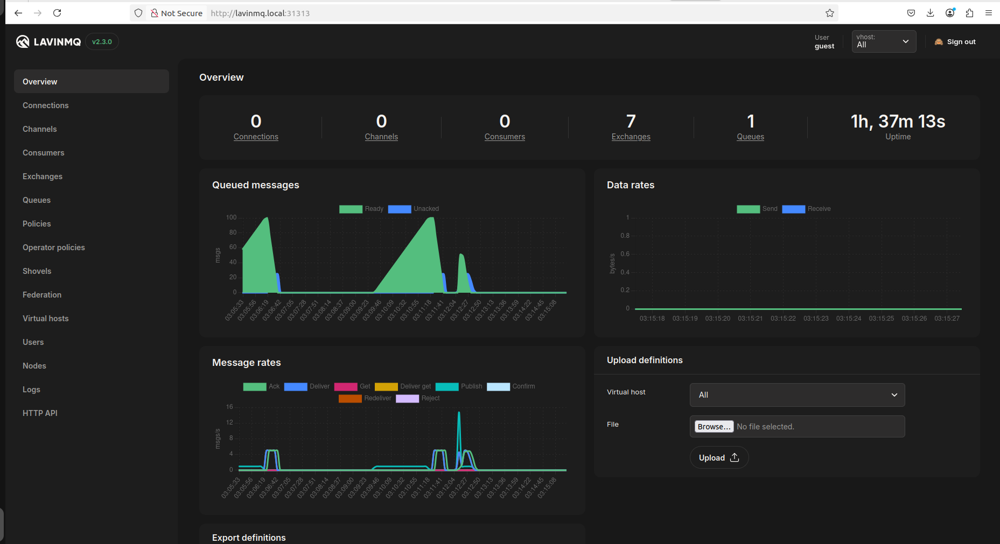
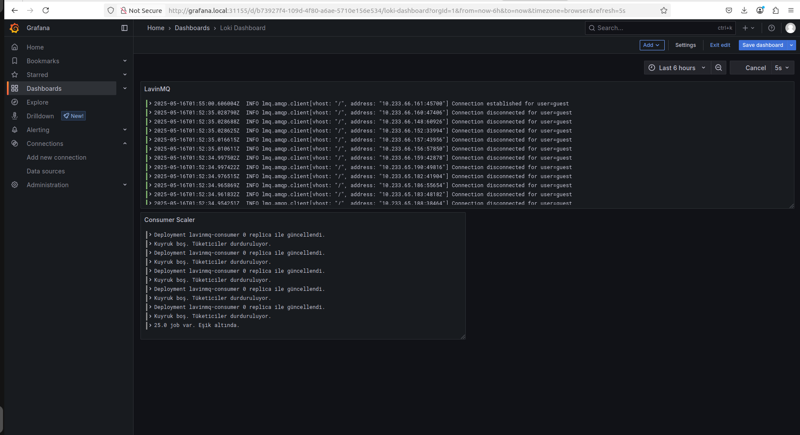
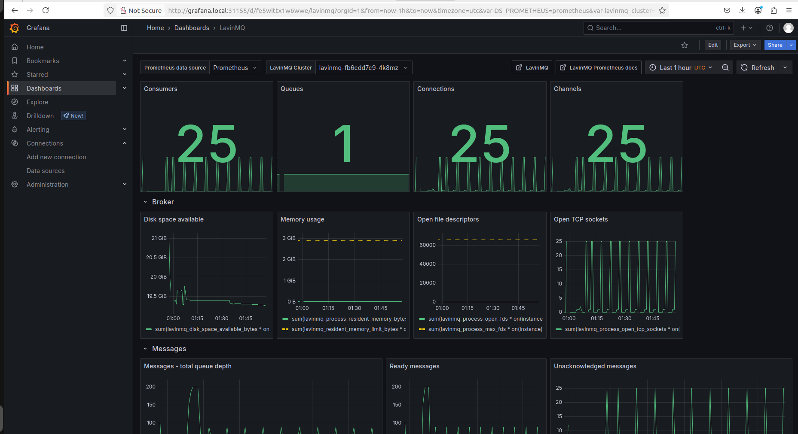

# 🚀 Kubernetes Tabanlı Kuyruk Tüketim ve İzleme Sistemi

Bu proje, Kubernetes üzerinde mesaj kuyruklarına iş atan, bu işleri tüketen ve sistem durumunu izleyen tam entegre bir otomasyon çözümüdür. Sistem, kuyruk yoğunluğuna göre pod ölçeklemesi yaparak kaynak kullanımını optimize eder.

---

## 🧱 Genel Mimarî

```
flowchart TD
    JP[Job Publisher (CronJob)]
    MQ[LavinMQ]
    CS[Consumer Pods]
    SC[Scaler Service]
    MON[Prometheus + Grafana]
    LOG[Loki + Grafana]

    JP --> MQ
    MQ --> CS
    MQ --> SC
    CS --> LOG
    MQ --> LOG
    SC --> MON
    CS --> MON
```

---

## ⚙️ Kullanılan Bileşenler

| Bileşen | Açıklama |
|--------|----------|
| ☸️ **Kubernetes** | 3 node'lu cluster (1 master + 2 worker) |
| 🧰 **KubeSpray** | Cluster kurulumu |
| 🔧 **Helm** | Prometheus ve bazı bileşenlerin kurulumu |
| 📬 **LavinMQ** | Mesaj kuyruğu servisi |
| 📈 **Prometheus & Grafana** | Metrik toplama ve görselleştirme |
| 📄 **Loki & Grafana** | Log toplama |
| 🐍 **Job Publisher (Python)** | Kuyruğa düzenli iş ekler |
| 🐍 **Consumer (Python)** | İşleri tüketir |
| 🐍 **Scaler (Python)** | Kuyruktaki iş sayısına göre pod’ları ölçekler |

---

## 🔁 İş Akışı

### 🧨 Job Publisher

-  Her **10 dakikada bir**, kuyruklara **100 adet job** gönderir.
- `CronJob` olarak çalışır.
-  Python ile yazılmıştır.
-  Image kişisel dockerhub registry'sinden çekilir.


### 🧲 Consumer

- Kuyruktan mesajları çeker ve işler.
- Varsayılan olarak **0 replica** olarak deploy edilmiştir.
- Image kişisel dockerhub registry'sinden çekilir.
- Her seferinde 1 job işleyecek şekilde ayarlanmıştır.

### 📈 Scaler Servisi

- 5 saniyede bir Prometheus API’ından lavinmq_queue_messages_ready metric'ğini sorgular.
- Eğer job sayısı > 100 ise `consumer` deployment'ını **25 replica**'ya çıkarır.
- Job yoksa replica sayısını **0** yapar.
- service-monitor objesi ile **lavinmq_queue_messages_ready** metric'iğinin Prometheus tarafından alabilmesi sağlandı. Bu metric ise lavinmq'nun sağlamış olduğu /metrics endpoint'i üzerinden okunur.

---

## 🖥️ İzleme ve Loglama

### 📊 Prometheus + Grafana

- CPU, bellek, pod sayısı gibi metrikler toplanır.
- LavinMQ ve scaler metrikleri de entegredir.


### 📑 Loki + Grafana

- Promtail (veya benzeri bir agent) Kubernetes podları ve sistemlerden logları toplar.
- Grafana’dan tüm loglar aranabilir ve filtrelenebilir.

---

## 🚀 Kurulum
Projenin geliştirme ortamı
```

PRETTY_NAME="Ubuntu 22.04.4 LTS"
NAME="Ubuntu"
VERSION_ID="22.04"
VERSION="22.04.4 LTS (Jammy Jellyfish)"
VERSION_CODENAME=jammy
ID=ubuntu
ID_LIKE=debian
HOME_URL="https://www.ubuntu.com/"
SUPPORT_URL="https://help.ubuntu.com/"
BUG_REPORT_URL="https://bugs.launchpad.net/ubuntu/"
PRIVACY_POLICY_URL="https://www.ubuntu.com/legal/terms-and-policies/privacy-policy"
UBUNTU_CODENAME=jammy

```

Tek komutla tüm sistemi kurabilirsiniz:


```bash
cd installation
chmod +x install.sh
./install.sh
```

### `install.sh` ne yapar?

1. Gerekli araçları kurar (`multipass`, `kubectl`, `helm`, `kubespray`).bkz [setup_tools.sh](https://github.com/orkunincili/s4e-cluster/blob/main/installation/setup_tools.sh)
2. 3 node’lu Kubernetes cluster kurulumu yapar. Bunlara;
   - Sunucuların kurulması (multipass)
   - SSH ile bağlanılabilir hale getirme (cloud-init)
   - Kubespray configurasyonu (hosts.yaml, all.yaml,k8s-cluster.yaml)
   - Ingsress'ler için hosts dosyası düzenlemesi (grafana, prometheus,lavinmq gibi)
   - LavninMQ için gerekli volume dizinlerinin oluşturulması (local-path çözümü)
   - Host makineden cluster yönetimi için config dosyasının master node'tan alınıp düzenlenmesi (etc/kubernetes/admin.conf)
     bkz.[create_cluster.sh](https://github.com/orkunincili/s4e-cluster/blob/main/installation/create_cluster.sh)
4. CoreDNS ayarlarını yapar. coredns'in sonsun döngüye girmesinden kaynaklı yaşanan CrashLoopBackOff çözümü için uygulandı. bkz [coredns.sh](https://github.com/orkunincili/s4e-cluster/blob/main/installation/coredns.sh)
5. Prometheus + Grafana stack’ini kurar.bkz.[install.sh](https://github.com/orkunincili/s4e-cluster/blob/main/installation/install.sh)
6. LavinMQ, job publisher, consumer, scaler, Loki + Grafana kurulumlarını yapar.bkz.[install.sh](https://github.com/orkunincili/s4e-cluster/blob/main/installation/install.sh)

---

## 📁 Proje Klasör Yapısı

```
.
├── consumer/                # Tüketici kodları ve deployment                     
├── installation/            # Kurulum scriptleri
├── job-publisher/           # CronJob + Python kodu
├── scaler/                  # Custom scaler kodu ve deployment
├── service-monitor/         # LavinMQ metrikleri için Prometheus yapılandırması
└── scaledobject/            # (KEDA kullanılmadıysa boş bırakılabilir)
└── ingresses/               # Gerekli ingress manifest dosyalarının bulunduğu dizin
└── images/                  # Görselleştirme amaçlı birkaç ekran görüntüsünün bulunduğu dizin

```

---

## 🔐 Güvenlik ve İzolasyon

- Her servis kendi `namespace` altında çalışır.
- LavinMQ API erişimi için `ServiceAccount` ve `Role` tanımları mevcuttur.
- Prometheus için `ServiceMonitor` ve `Secret`'lar tanımlıdır.

---

## 🧪 Test Edildi

- Kuyruğa her 10 dakikada bir 100 job eklendiğinde consumer pod’ları otomatik olarak ölçekleniyor.
- Kuyruk boşaldığında 0 pod’a düşülüyor.
- Monitoring ve loglama düzgün çalışıyor.

---

## 📌 Notlar

- Bu projede KEDA yerine custom scaler servisi yazılmıştır.
- `scaledobject/` klasörü, istenirse KEDA ile ilerlemek için hazır bırakılmıştır.
- KEDA'nın kullanılmama sebebi **case'e uygun** scale up/down yapamamasıdır.

---
##  Ekran Görüntüleri





